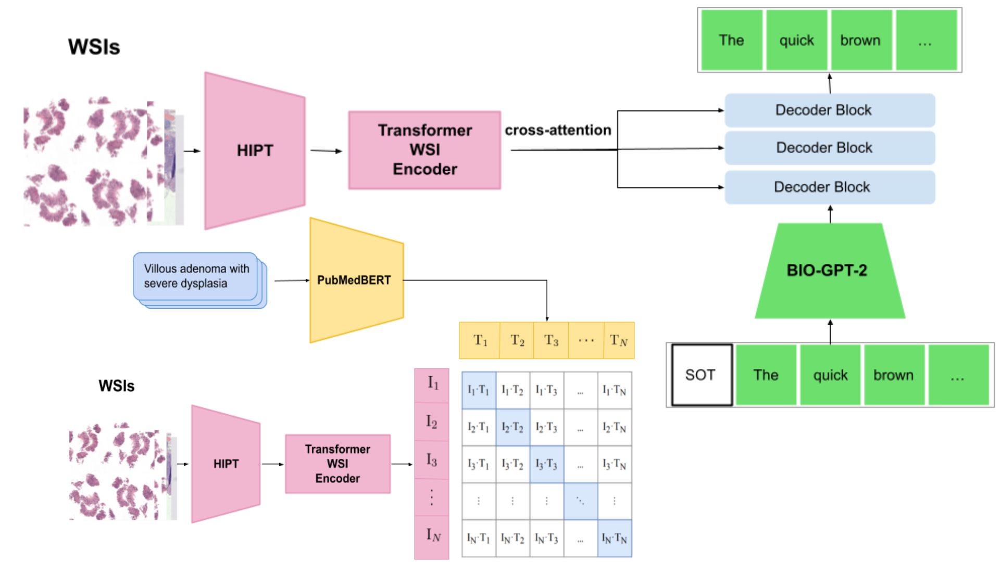

# WSI_captioning
Repo for WSI caption generation. This repository is accompanied by the caption generation for WSI [paper]( https://openreview.net/forum?id=gpsfGAOUs58).


# Requirements

Install the requirements in ```requirements.txt```.
 
This repo needs a contrastive whole slide image diagnostic report model trained on whole slide images and diagnostic reports. Additionally, the repo requires extracted WSI embeddings, Bio-GPT-2 embeddings and extracted PubmedBERT LM tokens. If you require access to these data, please mail ```bryan.cardenasguevara@surf.nl```.

# Run 

run

```
sh train_captioning.sh
```

This trains the model but does not evaluate it during training apart from computing the validation loss.

# Acknowledgement
This project has received funding from the European Union’s Horizon 2020 research and innovation programme under grant agreement No 825292. This project is better known as the ExaMode project. The objectives of the ExaMode project are:
1. Weakly-supervised knowledge discovery for exascale medical data.  
2. Develop extreme scale analytic tools for heterogeneous exascale multimodal and multimedia data.  
3. Healthcare & industry decision-making adoption of extreme-scale analysis and prediction tools.

For more information on the ExaMode project, please visit www.examode.eu. 

   
